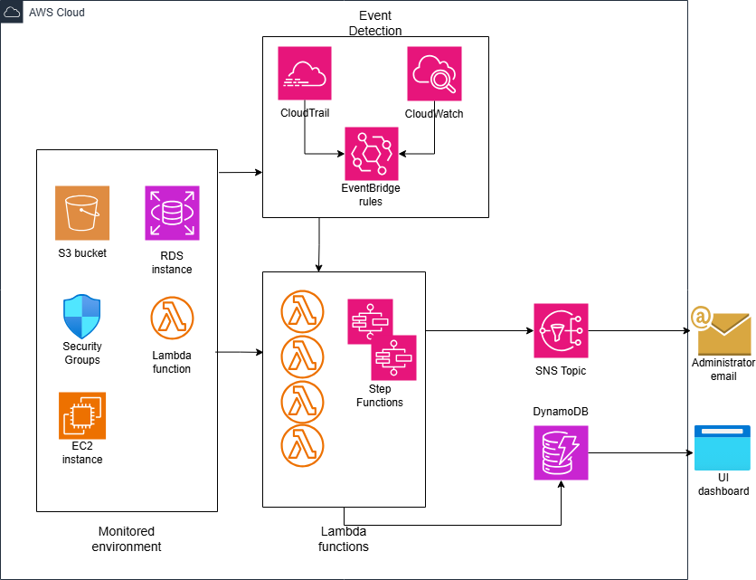

# Serverless Incident Management System (Bachelor Thesis Project)

This project was developed as part of my Bachelor's thesis at **VilniusTech**. It is a **serverless, event-driven incident management system** designed to detect and automatically remediate availability, performance, and security incidents in AWS environments.

## Project Highlights

- Built with **12+ AWS services**, including Lambda, Step Functions, EventBridge, CloudWatch, S3, EC2, RDS, SNS, and DynamoDB  
- Fully automated **incident response workflows** with sub-10s execution times  
- Deployed **Flask dashboard** for observability and status tracking  
- Infrastructure provisioned via **Terraform**, deployments automated with **CI/CD (GitHub Actions)**

## Use Cases Implemented

- S3 Public Access Revocation  
- RDS Connectivity Check and Automated Restart  
- Lambda Memory Exhaustion   
- Network anomaly patterns Detection  
- Unauthorized SSH access Revocation
- EC2 Disk Space Exhaustion  

## System Architecture

## Live Dashboard

[http://vilniustech.incident-dashboard-app.com](http://vilniustech.incident-dashboard-app.com)

## Key Goals

- Demonstrate **automated recovery workflows** using event-driven cloud architecture  
- Reduce incident response time and operational burden  
- Apply cloud-native design patterns and Infrastructure as Code
